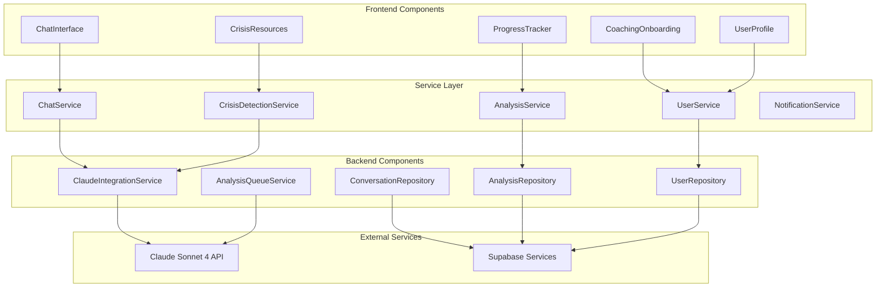

# Components

## Frontend Components

### ChatInterface

**Responsibility:** Primary conversation interface for user-AI coach interactions

**Key Interfaces:**

- sendMessage(text: string): Promise<ChatResponse>
- loadHistory(limit: number): Promise<Message[]>
- handleCrisisDetection(resources: CrisisResource[]): void

**Dependencies:** 
- ChatService (API communication)
- CrisisDetectionService (safety handling)
- UserStore (authentication state)

**Technology Stack:** Next.js 15 React component with WebSocket for real-time updates

### CoachingOnboarding

**Responsibility:** Goal selection and coaching agreement during user registration

**Key Interfaces:**

- selectGoals(goals: SocialGoal[]): void
- completeOnboarding(): Promise<void>
- showCoachingAgreement(): void

**Dependencies:**
- UserService (profile updates)
- OnboardingStore (flow state)

**Technology Stack:** Multi-step form with Zustand state management

### ProgressTracker

**Responsibility:** Display implicit progress indicators and milestone celebrations

**Key Interfaces:**

- displayEncouragement(message: string): void
- showMilestone(achievement: string): void
- updateProgressStatus(stage: CoachingStage): void

**Dependencies:**
- AnalysisService (progress data)
- NotificationService (celebration display)

**Technology Stack:** React component with Framer Motion animations

## Backend Components

### ClaudeIntegrationService

**Responsibility:** Manage all interactions with Claude Sonnet 4 API for coaching and analysis

**Key Interfaces:**

- async generate_coaching_response(message: str, context: UserContext) -> str
- async perform_chat_scoring(messages: List[Message]) -> AnalysisResult
- async detect_crisis(message: str) -> CrisisAssessment

**Dependencies:**
- Anthropic Python SDK
- ConversationRepository
- CrisisDetectionService
- Pydantic models

**Technology Stack:** Python FastAPI with asyncio and tenacity for retries

### ConversationRepository

**Responsibility:** Handle all conversation data persistence and retrieval

**Key Interfaces:**

- async save_message(message: MessageCreate) -> Conversation
- async get_history(user_id: str, limit: int) -> List[Conversation]
- async get_messages_for_analysis(user_id: str, count: int) -> List[Conversation]

**Dependencies:**
- asyncpg (PostgreSQL async driver)
- Supabase Python client
- SQLAlchemy Core for query building

**Technology Stack:** Repository pattern with async PostgreSQL operations

### AnalysisQueueService

**Responsibility:** Background processing of conversation analysis and ChAT scoring

**Key Interfaces:**

- async queue_analysis(user_id: str, trigger: AnalysisTrigger) -> None
- async process_analysis_job(job: AnalysisJob) -> AnalysisResult
- async handle_analysis_completion(result: AnalysisResult) -> None

**Dependencies:**
- Celery task queue
- Redis broker
- ClaudeIntegrationService
- NotificationService

**Technology Stack:** Celery with Redis for distributed task processing

## Component Diagrams

