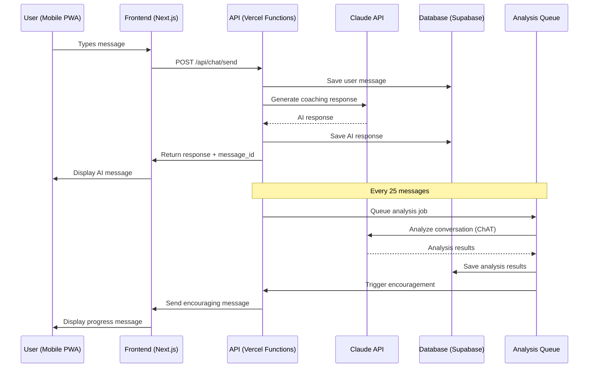
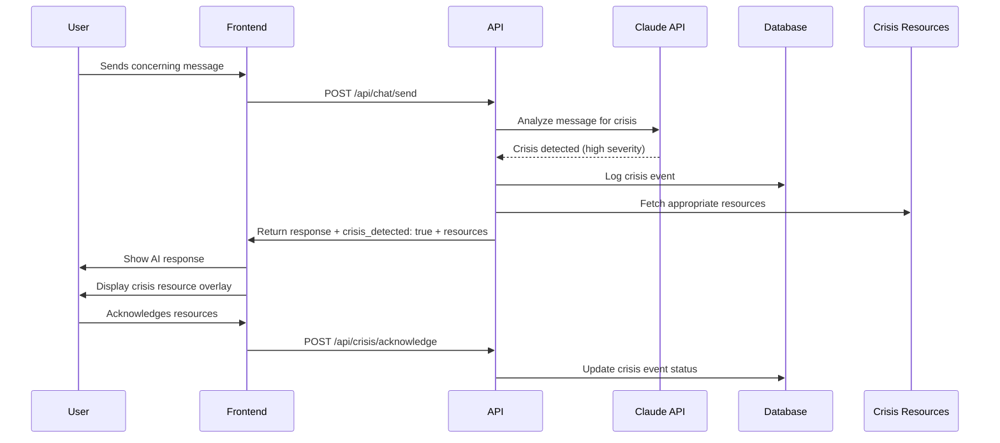
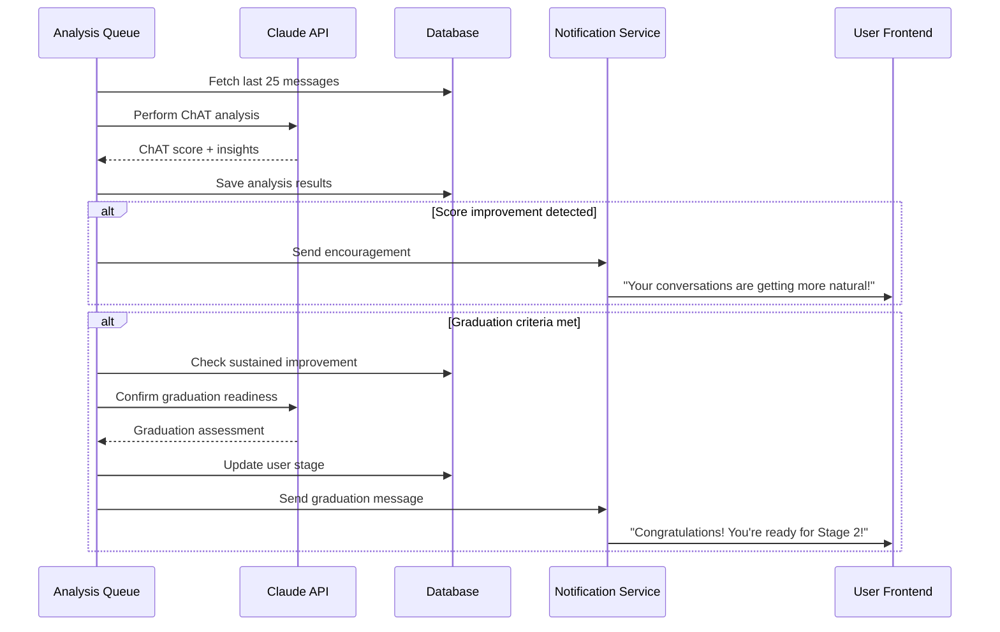

# Core Workflows

## Primary Coaching Conversation Flow

```mermaid
sequenceDiagram
    participant U as User (Mobile PWA)
    participant F as Frontend (Next.js)
    participant A as API (Vercel Functions)
    participant C as Claude API
    participant D as Database (Supabase)
    participant Q as Analysis Queue

    U->>F: Types message
    F->>A: POST /api/chat/send
    A->>D: Save user message
    A->>C: Generate coaching response
    C-->>A: AI response
    A->>D: Save AI response
    A->>F: Return response + message_id
    F->>U: Display AI message

    Note over A,Q: Every 25 messages
    A->>Q: Queue analysis job
    Q->>C: Analyze conversation (ChAT)
    C-->>Q: Analysis results
    Q->>D: Save analysis results
    Q->>A: Trigger encouragement
    A->>F: Send encouraging message
    F->>U: Display progress message
```

## Crisis Detection and Safety Flow

```mermaid
sequenceDiagram
    participant U as User
    participant F as Frontend
    participant A as API
    participant C as Claude API
    participant D as Database
    participant R as Crisis Resources

    U->>F: Sends concerning message
    F->>A: POST /api/chat/send
    A->>C: Analyze message for crisis
    C-->>A: Crisis detected (high severity)
    A->>D: Log crisis event
    A->>R: Fetch appropriate resources
    A->>F: Return response + crisis_detected: true + resources
    F->>U: Show AI response
    F->>U: Display crisis resource overlay
    U->>F: Acknowledges resources
    F->>A: POST /api/crisis/acknowledge
    A->>D: Update crisis event status
```

## Background Analysis and Graduation Assessment

```mermaid
sequenceDiagram
    participant Q as Analysis Queue
    participant C as Claude API
    participant D as Database
    participant N as Notification Service
    participant U as User Frontend

    Q->>D: Fetch last 25 messages
    Q->>C: Perform ChAT analysis
    C-->>Q: ChAT score + insights
    Q->>D: Save analysis results
    
    alt Score improvement detected
        Q->>N: Send encouragement
        N->>U: "Your conversations are getting more natural!"
    end
    
    alt Graduation criteria met
        Q->>D: Check sustained improvement
        Q->>C: Confirm graduation readiness
        C-->>Q: Graduation assessment
        Q->>D: Update user stage
        Q->>N: Send graduation message
        N->>U: "Congratulations! You're ready for Stage 2!"
    end
```
