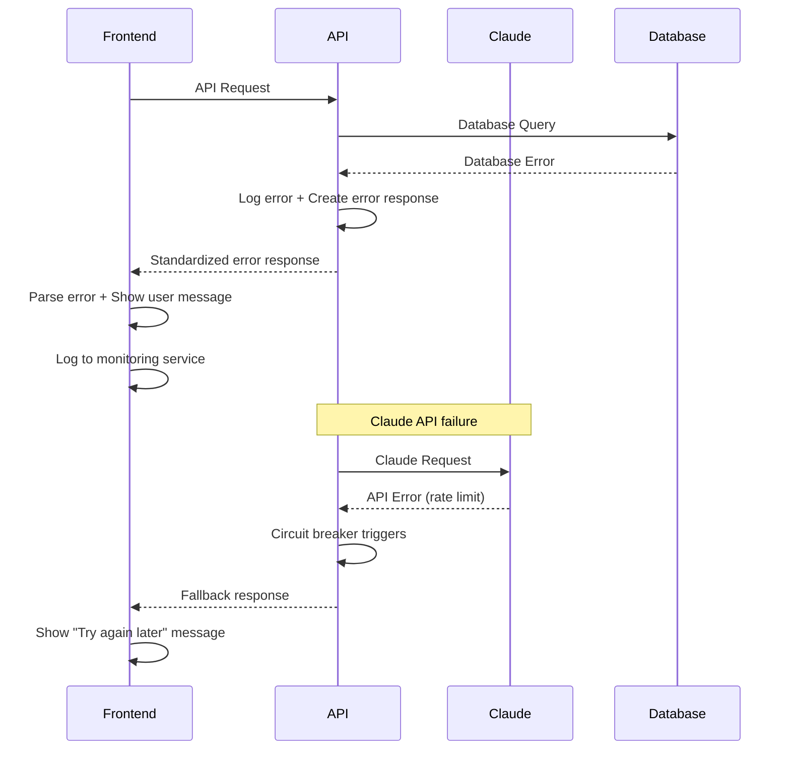

# Error Handling Strategy

## Error Flow



## Error Response Format

```typescript
interface ApiError {
  error: {
    code: string;
    message: string;
    details?: Record<string, any>;
    timestamp: string;
    requestId: string;
  };
}

// Standard error codes
enum ErrorCode {
  VALIDATION_ERROR = 'VALIDATION_ERROR',
  AUTHENTICATION_ERROR = 'AUTHENTICATION_ERROR',
  AUTHORIZATION_ERROR = 'AUTHORIZATION_ERROR',
  NOT_FOUND = 'NOT_FOUND',
  RATE_LIMITED = 'RATE_LIMITED',
  CLAUDE_API_ERROR = 'CLAUDE_API_ERROR',
  DATABASE_ERROR = 'DATABASE_ERROR',
  CRISIS_DETECTION_ERROR = 'CRISIS_DETECTION_ERROR',
  INTERNAL_ERROR = 'INTERNAL_ERROR'
}
```

## Frontend Error Handling

```typescript
// lib/errorHandler.ts
class ErrorHandler {
  static handle(error: ApiError | Error, context?: string) {
    console.error(`Error in ${context}:`, error);
    
    // Send to monitoring service
    if (process.env.NODE_ENV === 'production') {
      // Send to Vercel Analytics or error tracking service
    }
    
    // Return user-friendly message
    if ('error' in error) {
      return this.getUserMessage(error.error.code);
    }
    
    return 'Something went wrong. Please try again.';
  }
  
  private static getUserMessage(code: string): string {
    switch (code) {
      case 'CLAUDE_API_ERROR':
        return 'Our AI coach is temporarily unavailable. Please try again in a moment.';
      case 'RATE_LIMITED':
        return 'Please wait a moment before sending another message.';
      case 'VALIDATION_ERROR':
        return 'Please check your message and try again.';
      default:
        return 'Something went wrong. Please try again.';
    }
  }
}

// Usage in components
try {
  await chatService.sendMessage(message);
} catch (error) {
  const userMessage = ErrorHandler.handle(error, 'ChatInterface.sendMessage');
  setErrorMessage(userMessage);
}
```

## Backend Error Handling

```typescript
// lib/apiError.ts
export class ApiError extends Error {
  constructor(
    public code: string,
    public message: string,
    public statusCode: number = 500,
    public details?: Record<string, any>
  ) {
    super(message);
  }
}

// lib/errorMiddleware.ts
export function handleApiError(error: Error, requestId: string): NextResponse {
  console.error('API Error:', error);
  
  if (error instanceof ApiError) {
    return NextResponse.json({
      error: {
        code: error.code,
        message: error.message,
        details: error.details,
        timestamp: new Date().toISOString(),
        requestId
      }
    }, { status: error.statusCode });
  }
  
  // Unknown error - don't expose internal details
  return NextResponse.json({
    error: {
      code: 'INTERNAL_ERROR',
      message: 'An unexpected error occurred',
      timestamp: new Date().toISOString(),
      requestId
    }
  }, { status: 500 });
}

// Usage in API routes
export async function POST(request: NextRequest) {
  const requestId = crypto.randomUUID();
  
  try {
    // API logic here
  } catch (error) {
    return handleApiError(error, requestId);
  }
}
```
