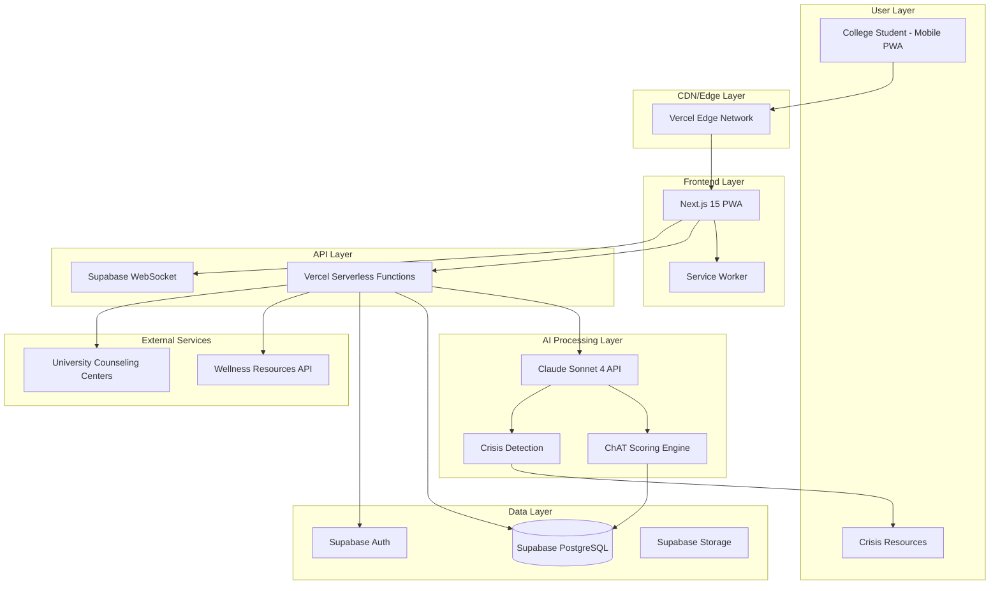

# High Level Architecture

## Technical Summary

Noria implements a modern fullstack architecture with Next.js 15 PWA frontend and Python FastAPI backend, deployed on Vercel with Supabase services. The TypeScript PWA provides native-like mobile experience with offline capability, while Python FastAPI handles Claude Sonnet 4 integration for sophisticated conversation analysis and crisis detection. Real-time conversation flow is managed through Supabase's PostgreSQL database with WebSocket connections for instant messaging. The Python backend leverages the rich AI/ML ecosystem for evidence-based ChAT scoring analysis that remains invisible to users, creating a coaching experience that builds genuine social confidence rather than platform dependency.

## Platform and Infrastructure Choice

**Platform:** Vercel + Supabase
**Key Services:** 
- Vercel (Frontend hosting, Serverless Functions, Edge CDN)
- Supabase (PostgreSQL database, Real-time subscriptions, Authentication, File storage)
- Anthropic Claude Sonnet 4 (AI coaching and conversation analysis)

**Deployment Host and Regions:** Vercel Edge Network (Global CDN), Supabase US East (Primary database region)

**Rationale:** Zero-cost development with automatic scaling, integrated authentication, and optimized for college student mobile usage patterns. Vercel's edge network ensures <2s response times globally.

## Repository Structure

**Structure:** Monorepo with shared packages
**Monorepo Tool:** Turborepo (integrated with Vercel)
**Package Organization:** Apps (web, api functions) + Packages (shared types, UI components)

## High Level Architecture Diagram

## Architectural Patterns

- **Jamstack Architecture:** Static site generation with serverless APIs - _Rationale:_ Optimal performance and scalability for mobile-first coaching experience
- **Progressive Web App (PWA):** Offline-capable mobile experience - _Rationale:_ Native app features without app store complexity or cost
- **Event-Driven Messaging:** Real-time conversation flow with background analysis - _Rationale:_ Seamless coaching experience with invisible evidence collection
- **Repository Pattern:** Abstract data access logic - _Rationale:_ Enables testing and future database migration flexibility
- **Circuit Breaker Pattern:** Resilient Claude API integration - _Rationale:_ Graceful degradation when AI services are unavailable
- **Background Job Processing:** Async ChAT scoring analysis - _Rationale:_ User experience remains responsive while evidence is collected
- **Defensive Design:** Safety-first crisis detection - _Rationale:_ Prioritizes user wellbeing over feature completeness
