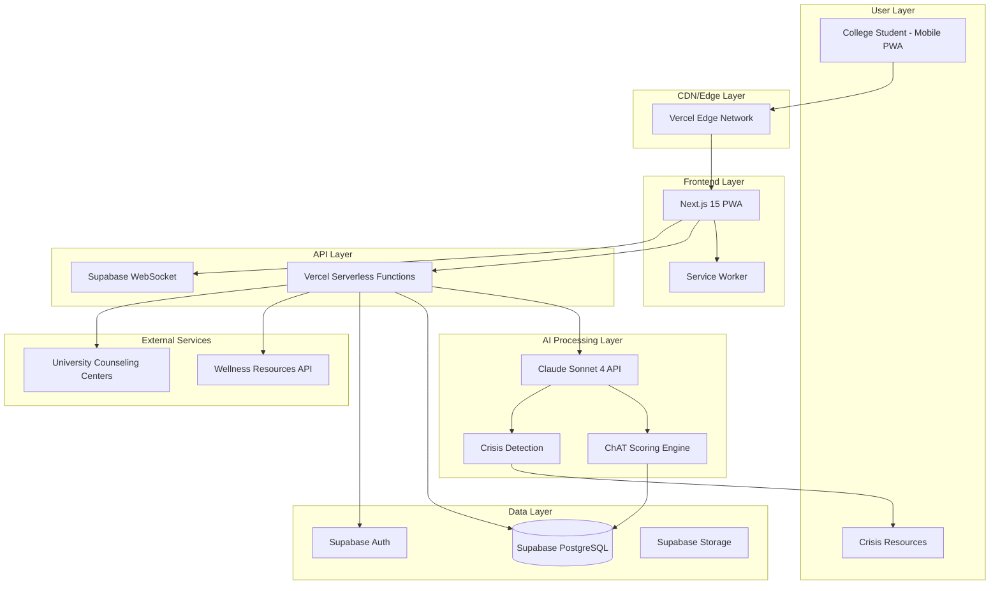
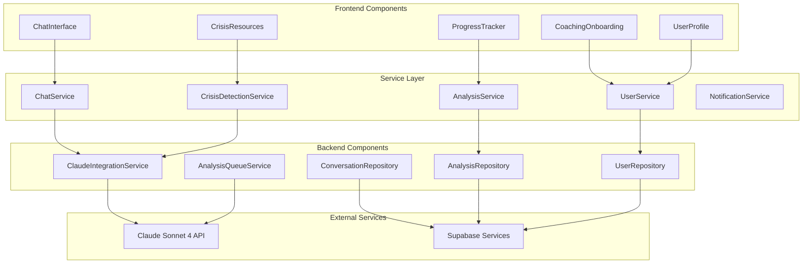
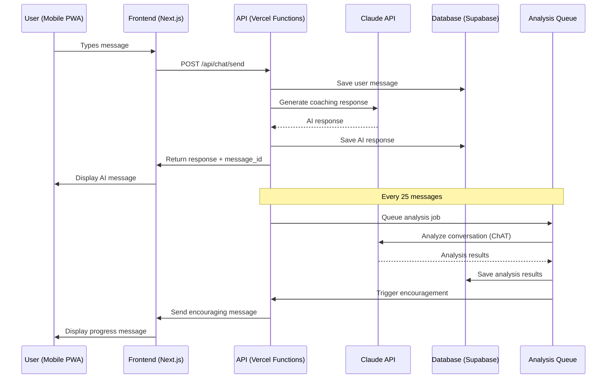
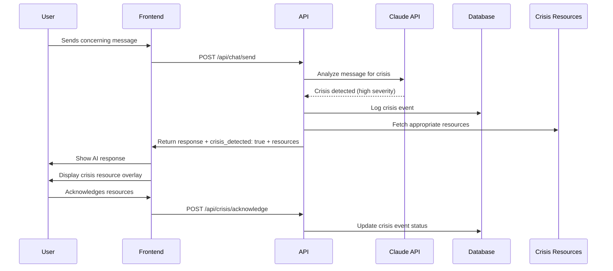
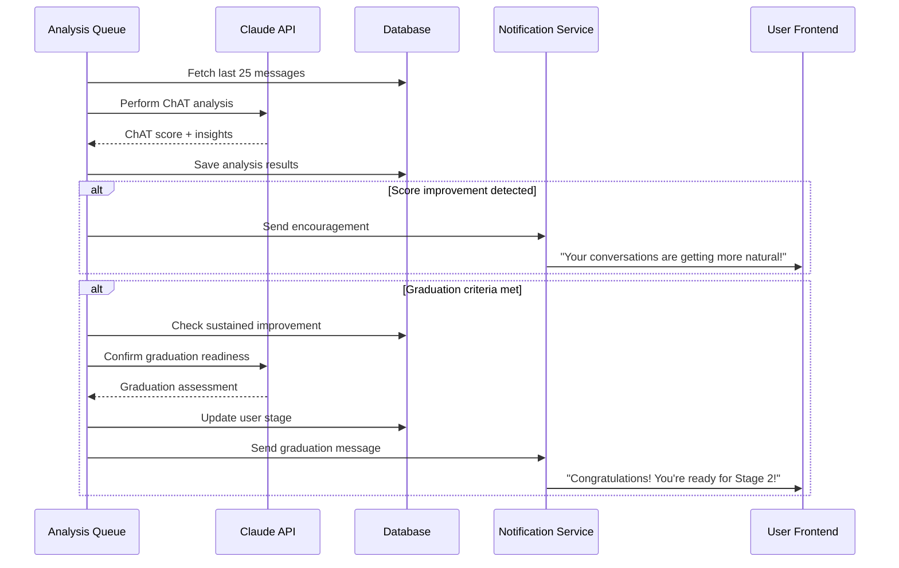
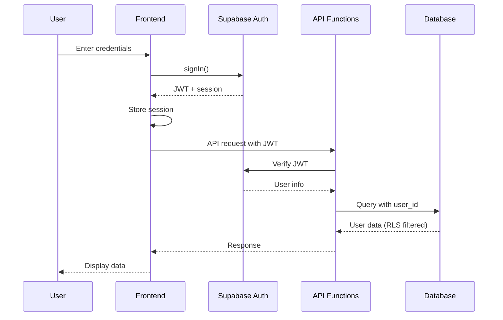
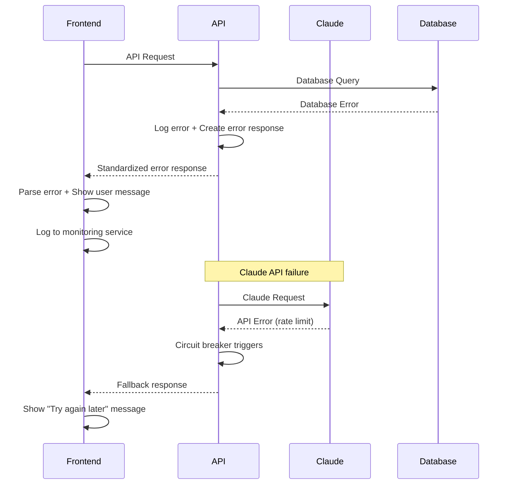

# NORIA Fullstack Architecture Document

## Introduction

This document outlines the complete fullstack architecture for Noria - an AI social coaching platform for college students. It serves as the single source of truth for AI-driven development, ensuring consistency across the entire technology stack.

This unified approach combines backend systems, frontend implementation, and their integration, streamlining the development process for Noria's unique graduation-focused coaching model where user success is measured by completion rather than retention.

### Starter Template or Existing Project

**Status:** Greenfield project - Custom zero-cost architecture optimized for MVP development

**Rationale:** Zero-cost development stack optimized for solo developer with structured growth to full mobile apps in Phase 2. PWA provides native-like mobile experience without app store complexity.

### Change Log

| Date | Version | Description | Author |
| :--- | :------ | :---------- | :----- |
| 2025-01-11 | 1.0 | Initial fullstack architecture for MVP | Winston - Architect |

## High Level Architecture

### Technical Summary

Noria implements a modern fullstack architecture with Next.js 15 PWA frontend and Python FastAPI backend, deployed on Vercel with Supabase services. The TypeScript PWA provides native-like mobile experience with offline capability, while Python FastAPI handles Claude Sonnet 4 integration for sophisticated conversation analysis and crisis detection. Real-time conversation flow is managed through Supabase's PostgreSQL database with WebSocket connections for instant messaging. The Python backend leverages the rich AI/ML ecosystem for evidence-based ChAT scoring analysis that remains invisible to users, creating a coaching experience that builds genuine social confidence rather than platform dependency.

### Platform and Infrastructure Choice

**Platform:** Vercel + Supabase
**Key Services:** 
- Vercel (Frontend hosting, Serverless Functions, Edge CDN)
- Supabase (PostgreSQL database, Real-time subscriptions, Authentication, File storage)
- Anthropic Claude Sonnet 4 (AI coaching and conversation analysis)

**Deployment Host and Regions:** Vercel Edge Network (Global CDN), Supabase US East (Primary database region)

**Rationale:** Zero-cost development with automatic scaling, integrated authentication, and optimized for college student mobile usage patterns. Vercel's edge network ensures <2s response times globally.

### Repository Structure

**Structure:** Monorepo with shared packages
**Monorepo Tool:** Turborepo (integrated with Vercel)
**Package Organization:** Apps (web, api functions) + Packages (shared types, UI components)

### High Level Architecture Diagram



### Architectural Patterns

- **Jamstack Architecture:** Static site generation with serverless APIs - _Rationale:_ Optimal performance and scalability for mobile-first coaching experience
- **Progressive Web App (PWA):** Offline-capable mobile experience - _Rationale:_ Native app features without app store complexity or cost
- **Event-Driven Messaging:** Real-time conversation flow with background analysis - _Rationale:_ Seamless coaching experience with invisible evidence collection
- **Repository Pattern:** Abstract data access logic - _Rationale:_ Enables testing and future database migration flexibility
- **Circuit Breaker Pattern:** Resilient Claude API integration - _Rationale:_ Graceful degradation when AI services are unavailable
- **Background Job Processing:** Async ChAT scoring analysis - _Rationale:_ User experience remains responsive while evidence is collected
- **Defensive Design:** Safety-first crisis detection - _Rationale:_ Prioritizes user wellbeing over feature completeness

## Tech Stack

### Technology Stack Table

| Category | Technology | Version | Purpose | Rationale |
| :----------------------- | :---------------- | :---------- | :---------- | :------------- |
| **Frontend Language** | TypeScript | 5.3.3 | Type-safe frontend development | Strong typing, code sharing with backend |
| **Frontend Framework** | Next.js | 15.0.0 | React framework with SSR/SSG | PWA support, Vercel optimization, mobile-first |
| **UI Component Library** | shadcn/ui + Tailwind | Latest | Modern, accessible components | Consistent design system, mobile optimization |
| **State Management** | Zustand | 4.4.6 | Lightweight state management | Simple API, TypeScript support, no boilerplate |
| **Backend Language** | Python | 3.11+ | Backend development language | AI/ML ecosystem, mature libraries |
| **Backend Framework** | FastAPI | 0.104.0+ | Modern Python web framework | Async support, auto-docs, type hints |
| **API Style** | REST + WebSocket | - | HTTP APIs + real-time messaging | Simple, well-supported, real-time chat |
| **Database** | PostgreSQL | 15.0 | Primary data store | ACID compliance, JSON support, Supabase integration |
| **Real-time** | Supabase Realtime | 2.39.0 | WebSocket subscriptions | Live conversation updates, PostgreSQL triggers |
| **File Storage** | Supabase Storage | 2.39.0 | User files, assets | S3-compatible, integrated authentication |
| **Authentication** | Supabase Auth | 2.39.0 | User authentication | Email/password, social providers, JWTs |
| **AI Integration** | Anthropic SDK (Python) | Latest | Claude Sonnet 4 integration | Rich Python AI ecosystem, async support |
| **Frontend Testing** | Vitest + Testing Library | Latest | Component and unit testing | Fast, modern testing with TypeScript |
| **Backend Testing** | pytest + httpx | Latest | API endpoint testing | Python standard, async HTTP testing |
| **E2E Testing** | Playwright | Latest | Full user journey testing | Cross-browser, mobile testing, reliability |
| **Build Tool** | Turborepo | Latest | Monorepo build orchestration | Caching, parallel builds, Vercel integration |
| **Python Package Manager** | uv | Latest | Fast Python dependency management | 10-100x faster than pip/poetry, reliable resolution |
| **CSS Framework** | Tailwind CSS | 3.4.0 | Utility-first styling | Mobile-first design, component consistency |
| **PWA** | Next.js PWA | Latest | Progressive web app features | Offline capability, home screen install |
| **Deployment** | Vercel | - | Frontend and API hosting | Zero-config deployment, edge optimization |
| **Monitoring** | Vercel Analytics | - | Performance and error tracking | Built-in monitoring, zero configuration |
| **Queue System** | Celery + Redis | Latest | Background job processing | Mature Python task queue, scalable |

## Data Models

### User

**Purpose:** Represents authenticated users (college students) in the coaching system

**Key Attributes:**

- id: string (UUID) - Unique identifier from Supabase Auth
- email: string - University email address
- goals: string[] - Selected social coaching goals
- stage: enum - Current coaching stage (1, 2, 3, graduated)
- created_at: timestamp - Account creation
- last_active: timestamp - Last conversation activity
- graduation_date: timestamp? - When user completed coaching

**TypeScript Interface:**

```typescript
interface User {
  id: string; // Supabase Auth UUID
  email: string;
  goals: SocialGoal[];
  stage: CoachingStage;
  profile: UserProfile;
  preferences: UserPreferences;
  created_at: string;
  updated_at: string;
  last_active: string;
  graduation_date?: string;
}

interface UserProfile {
  university?: string;
  year_in_school?: string;
  timezone?: string;
}

interface UserPreferences {
  crisis_resources_acknowledged: boolean;
  coaching_style: 'encouraging' | 'direct' | 'gentle';
  notification_preferences: NotificationSettings;
}

type SocialGoal = 
  | 'build_confidence'
  | 'make_friends'
  | 'improve_conversations'
  | 'overcome_anxiety'
  | 'join_activities'
  | 'dating_skills'
  | 'roommate_relations';

type CoachingStage = 1 | 2 | 3 | 'graduated';
```

**Relationships:**

- Has many Conversations (1:n)
- Has many AnalysisResults (1:n)
- Has many CrisisEvents (1:n)

### Conversation

**Purpose:** Stores all messages between users and Noria AI coach for persistent chat history

**Key Attributes:**

- id: string (UUID) - Unique message identifier
- user_id: string - Foreign key to User
- message_text: string - Message content
- sender_type: enum - 'user' or 'assistant'
- timestamp: timestamp - Message creation time
- message_metadata: json - Additional context (emotion, intent, etc.)

**TypeScript Interface:**

```typescript
interface Conversation {
  id: string;
  user_id: string;
  message_text: string;
  sender_type: 'user' | 'assistant';
  timestamp: string;
  message_metadata: MessageMetadata;
  analysis_included: boolean; // Whether this message was included in ChAT analysis
}

interface MessageMetadata {
  emotion_detected?: string;
  intent_category?: string;
  crisis_keywords?: string[];
  coaching_topic?: string;
  response_time_ms?: number;
}
```

**Relationships:**

- Belongs to User (n:1)
- Referenced by AnalysisResults (n:m)

### AnalysisResult

**Purpose:** Stores ChAT scoring results and coaching insights from conversation analysis

**Key Attributes:**

- id: string (UUID) - Unique analysis identifier
- user_id: string - Foreign key to User
- chat_score: number - ChAT score (0-14)
- analysis_type: enum - Type of analysis performed
- message_range: json - Range of messages analyzed
- insights: json - Structured analysis insights
- timestamp: timestamp - When analysis was performed

**TypeScript Interface:**

```typescript
interface AnalysisResult {
  id: string;
  user_id: string;
  chat_score: number; // 0-14 scale
  analysis_type: AnalysisType;
  message_range: MessageRange;
  insights: AnalysisInsights;
  improvement_areas: string[];
  strengths_identified: string[];
  timestamp: string;
  triggered_milestone: boolean;
}

interface MessageRange {
  start_message_id: string;
  end_message_id: string;
  total_messages: number;
  analysis_window: string; // e.g., "last_25_messages"
}

interface AnalysisInsights {
  conversation_quality: ConversationQuality;
  social_skills_progress: SocialSkillsProgress;
  coaching_effectiveness: CoachingEffectiveness;
}

interface ConversationQuality {
  naturalness_score: number;
  engagement_level: number;
  emotional_awareness: number;
  question_asking: number;
}

type AnalysisType = 'chat_scoring' | 'milestone_check' | 'graduation_assessment' | 'crisis_review';
```

**Relationships:**

- Belongs to User (n:1)
- References Conversation messages (n:m)

### CrisisEvent

**Purpose:** Tracks crisis detection events and safety interventions for user protection

**Key Attributes:**

- id: string (UUID) - Unique crisis identifier
- user_id: string - Foreign key to User
- trigger_type: enum - What triggered the crisis detection
- severity_level: enum - Assessed severity level
- message_id: string - Message that triggered detection
- resources_shown: json - Which resources were displayed
- timestamp: timestamp - When crisis was detected

**TypeScript Interface:**

```typescript
interface CrisisEvent {
  id: string;
  user_id: string;
  trigger_type: CrisisType;
  severity_level: SeverityLevel;
  message_id: string;
  keywords_detected: string[];
  resources_shown: CrisisResource[];
  user_acknowledged: boolean;
  followup_required: boolean;
  timestamp: string;
  resolution_timestamp?: string;
}

type CrisisType = 
  | 'suicide_ideation'
  | 'self_harm'
  | 'severe_depression'
  | 'abuse_disclosure'
  | 'eating_disorder'
  | 'substance_abuse';

type SeverityLevel = 'low' | 'moderate' | 'high' | 'critical';

interface CrisisResource {
  type: 'hotline' | 'chat' | 'text' | 'website';
  name: string;
  contact: string;
  description: string;
  availability: string;
}
```

**Relationships:**

- Belongs to User (n:1)
- References specific Conversation message (n:1)

## REST API Spec

```yaml
openapi: 3.0.0
info:
  title: Noria AI Social Coaching API
  version: 1.0.0
  description: Backend API for Noria's evidence-based social coaching platform
servers:
  - url: https://noria-app.vercel.app/api
    description: Production API
  - url: http://localhost:3000/api
    description: Local development
paths:
  /auth/signup:
    post:
      summary: Create new user account
      requestBody:
        required: true
        content:
          application/json:
            schema:
              type: object
              properties:
                email:
                  type: string
                  format: email
                password:
                  type: string
                  minLength: 8
                goals:
                  type: array
                  items:
                    $ref: '#/components/schemas/SocialGoal'
      responses:
        201:
          description: Account created successfully
          content:
            application/json:
              schema:
                $ref: '#/components/schemas/User'
        400:
          $ref: '#/components/responses/ValidationError'

  /chat/send:
    post:
      summary: Send message to AI coach
      security:
        - bearerAuth: []
      requestBody:
        required: true
        content:
          application/json:
            schema:
              type: object
              properties:
                message:
                  type: string
                  maxLength: 2000
      responses:
        200:
          description: Coach response generated
          content:
            application/json:
              schema:
                type: object
                properties:
                  response:
                    type: string
                  message_id:
                    type: string
                  crisis_detected:
                    type: boolean
                  resources:
                    type: array
                    items:
                      $ref: '#/components/schemas/CrisisResource'

  /chat/history:
    get:
      summary: Get conversation history
      security:
        - bearerAuth: []
      parameters:
        - name: limit
          in: query
          schema:
            type: integer
            default: 50
        - name: before
          in: query
          schema:
            type: string
      responses:
        200:
          description: Conversation history
          content:
            application/json:
              schema:
                type: object
                properties:
                  messages:
                    type: array
                    items:
                      $ref: '#/components/schemas/Conversation'

  /analysis/trigger:
    post:
      summary: Manually trigger conversation analysis
      security:
        - bearerAuth: []
      responses:
        202:
          description: Analysis queued for processing

  /user/profile:
    get:
      summary: Get user profile
      security:
        - bearerAuth: []
      responses:
        200:
          description: User profile data
          content:
            application/json:
              schema:
                $ref: '#/components/schemas/User'
    patch:
      summary: Update user profile
      security:
        - bearerAuth: []
      requestBody:
        required: true
        content:
          application/json:
            schema:
              type: object
              properties:
                goals:
                  type: array
                  items:
                    $ref: '#/components/schemas/SocialGoal'
                preferences:
                  $ref: '#/components/schemas/UserPreferences'

  /wellness/resources:
    get:
      summary: Get wellness resources
      responses:
        200:
          description: Available wellness resources
          content:
            application/json:
              schema:
                type: array
                items:
                  $ref: '#/components/schemas/WellnessResource'

components:
  schemas:
    User:
      type: object
      properties:
        id:
          type: string
        email:
          type: string
        goals:
          type: array
          items:
            $ref: '#/components/schemas/SocialGoal'
        stage:
          $ref: '#/components/schemas/CoachingStage'
        profile:
          $ref: '#/components/schemas/UserProfile'
        created_at:
          type: string
          format: date-time
        last_active:
          type: string
          format: date-time
    
    SocialGoal:
      type: string
      enum:
        - build_confidence
        - make_friends
        - improve_conversations
        - overcome_anxiety
        - join_activities
        - dating_skills
        - roommate_relations
    
    CoachingStage:
      type: integer
      enum: [1, 2, 3]
    
    Conversation:
      type: object
      properties:
        id:
          type: string
        user_id:
          type: string
        message_text:
          type: string
        sender_type:
          type: string
          enum: [user, assistant]
        timestamp:
          type: string
          format: date-time
        message_metadata:
          type: object

  securitySchemes:
    bearerAuth:
      type: http
      scheme: bearer
      bearerFormat: JWT

  responses:
    ValidationError:
      description: Validation error
      content:
        application/json:
          schema:
            type: object
            properties:
              error:
                type: object
                properties:
                  code:
                    type: string
                  message:
                    type: string
                  details:
                    type: object
```

## Components

### Frontend Components

#### ChatInterface

**Responsibility:** Primary conversation interface for user-AI coach interactions

**Key Interfaces:**

- sendMessage(text: string): Promise<ChatResponse>
- loadHistory(limit: number): Promise<Message[]>
- handleCrisisDetection(resources: CrisisResource[]): void

**Dependencies:** 
- ChatService (API communication)
- CrisisDetectionService (safety handling)
- UserStore (authentication state)

**Technology Stack:** Next.js 15 React component with WebSocket for real-time updates

#### CoachingOnboarding

**Responsibility:** Goal selection and coaching agreement during user registration

**Key Interfaces:**

- selectGoals(goals: SocialGoal[]): void
- completeOnboarding(): Promise<void>
- showCoachingAgreement(): void

**Dependencies:**
- UserService (profile updates)
- OnboardingStore (flow state)

**Technology Stack:** Multi-step form with Zustand state management

#### ProgressTracker

**Responsibility:** Display implicit progress indicators and milestone celebrations

**Key Interfaces:**

- displayEncouragement(message: string): void
- showMilestone(achievement: string): void
- updateProgressStatus(stage: CoachingStage): void

**Dependencies:**
- AnalysisService (progress data)
- NotificationService (celebration display)

**Technology Stack:** React component with Framer Motion animations

### Backend Components

#### ClaudeIntegrationService

**Responsibility:** Manage all interactions with Claude Sonnet 4 API for coaching and analysis

**Key Interfaces:**

- async generate_coaching_response(message: str, context: UserContext) -> str
- async perform_chat_scoring(messages: List[Message]) -> AnalysisResult
- async detect_crisis(message: str) -> CrisisAssessment

**Dependencies:**
- Anthropic Python SDK
- ConversationRepository
- CrisisDetectionService
- Pydantic models

**Technology Stack:** Python FastAPI with asyncio and tenacity for retries

#### ConversationRepository

**Responsibility:** Handle all conversation data persistence and retrieval

**Key Interfaces:**

- async save_message(message: MessageCreate) -> Conversation
- async get_history(user_id: str, limit: int) -> List[Conversation]
- async get_messages_for_analysis(user_id: str, count: int) -> List[Conversation]

**Dependencies:**
- asyncpg (PostgreSQL async driver)
- Supabase Python client
- SQLAlchemy Core for query building

**Technology Stack:** Repository pattern with async PostgreSQL operations

#### AnalysisQueueService

**Responsibility:** Background processing of conversation analysis and ChAT scoring

**Key Interfaces:**

- async queue_analysis(user_id: str, trigger: AnalysisTrigger) -> None
- async process_analysis_job(job: AnalysisJob) -> AnalysisResult
- async handle_analysis_completion(result: AnalysisResult) -> None

**Dependencies:**
- Celery task queue
- Redis broker
- ClaudeIntegrationService
- NotificationService

**Technology Stack:** Celery with Redis for distributed task processing

### Component Diagrams



## External APIs

### Claude Sonnet 4 API

- **Purpose:** AI coaching responses and conversation analysis
- **Documentation:** https://docs.anthropic.com/en/api/
- **Base URL(s):** `https://api.anthropic.com/v1`
- **Authentication:** Bearer token with API key
- **Rate Limits:** 1000 requests/minute, 32k context window

**Key Endpoints Used:**

- `POST /messages` - Generate coaching responses
- `POST /messages` - Perform ChAT scoring analysis
- `POST /messages` - Crisis detection and safety assessment

**Integration Notes:** 
- Circuit breaker pattern for reliability
- Streaming responses for better UX
- Context window management for long conversations
- Safety prompts integrated into all requests

### Supabase Services

- **Purpose:** Database, authentication, real-time subscriptions, file storage
- **Documentation:** https://supabase.com/docs
- **Base URL(s):** `https://{project-id}.supabase.co`
- **Authentication:** JWT tokens, API keys
- **Rate Limits:** 500 requests/second on Pro plan

**Key Endpoints Used:**

- `POST /auth/v1/signup` - User registration
- `POST /auth/v1/token` - Authentication
- `GET /rest/v1/conversations` - Conversation history
- `POST /rest/v1/conversations` - Save messages
- WebSocket endpoint for real-time updates

**Integration Notes:**
- Row Level Security (RLS) for data protection
- Real-time subscriptions for live chat
- Automatic JWT refresh handling
- Database triggers for analysis queue

## Core Workflows

### Primary Coaching Conversation Flow



### Crisis Detection and Safety Flow



### Background Analysis and Graduation Assessment



## Database Schema

```sql
-- Enable UUID extension
CREATE EXTENSION IF NOT EXISTS "uuid-ossp";

-- Users table (extends Supabase auth.users)
CREATE TABLE public.users (
    id UUID REFERENCES auth.users(id) PRIMARY KEY,
    email TEXT NOT NULL,
    goals TEXT[] NOT NULL DEFAULT '{}',
    stage INTEGER NOT NULL DEFAULT 1 CHECK (stage IN (1, 2, 3)),
    profile JSONB NOT NULL DEFAULT '{}',
    preferences JSONB NOT NULL DEFAULT '{}',
    created_at TIMESTAMP WITH TIME ZONE DEFAULT NOW(),
    updated_at TIMESTAMP WITH TIME ZONE DEFAULT NOW(),
    last_active TIMESTAMP WITH TIME ZONE DEFAULT NOW(),
    graduation_date TIMESTAMP WITH TIME ZONE
);

-- Conversations table
CREATE TABLE public.conversations (
    id UUID DEFAULT uuid_generate_v4() PRIMARY KEY,
    user_id UUID NOT NULL REFERENCES public.users(id) ON DELETE CASCADE,
    message_text TEXT NOT NULL,
    sender_type TEXT NOT NULL CHECK (sender_type IN ('user', 'assistant')),
    message_metadata JSONB NOT NULL DEFAULT '{}',
    analysis_included BOOLEAN NOT NULL DEFAULT FALSE,
    created_at TIMESTAMP WITH TIME ZONE DEFAULT NOW()
);

-- Analysis results table
CREATE TABLE public.analysis_results (
    id UUID DEFAULT uuid_generate_v4() PRIMARY KEY,
    user_id UUID NOT NULL REFERENCES public.users(id) ON DELETE CASCADE,
    chat_score DECIMAL(3,1) NOT NULL CHECK (chat_score >= 0 AND chat_score <= 14),
    analysis_type TEXT NOT NULL CHECK (analysis_type IN ('chat_scoring', 'milestone_check', 'graduation_assessment', 'crisis_review')),
    message_range JSONB NOT NULL,
    insights JSONB NOT NULL DEFAULT '{}',
    improvement_areas TEXT[] NOT NULL DEFAULT '{}',
    strengths_identified TEXT[] NOT NULL DEFAULT '{}',
    triggered_milestone BOOLEAN NOT NULL DEFAULT FALSE,
    created_at TIMESTAMP WITH TIME ZONE DEFAULT NOW()
);

-- Crisis events table
CREATE TABLE public.crisis_events (
    id UUID DEFAULT uuid_generate_v4() PRIMARY KEY,
    user_id UUID NOT NULL REFERENCES public.users(id) ON DELETE CASCADE,
    message_id UUID NOT NULL REFERENCES public.conversations(id) ON DELETE CASCADE,
    trigger_type TEXT NOT NULL,
    severity_level TEXT NOT NULL CHECK (severity_level IN ('low', 'moderate', 'high', 'critical')),
    keywords_detected TEXT[] NOT NULL DEFAULT '{}',
    resources_shown JSONB NOT NULL DEFAULT '[]',
    user_acknowledged BOOLEAN NOT NULL DEFAULT FALSE,
    followup_required BOOLEAN NOT NULL DEFAULT FALSE,
    created_at TIMESTAMP WITH TIME ZONE DEFAULT NOW(),
    resolution_timestamp TIMESTAMP WITH TIME ZONE
);

-- Job queue table (for pg-boss)
CREATE TABLE public.job_queue (
    id UUID DEFAULT uuid_generate_v4() PRIMARY KEY,
    name TEXT NOT NULL,
    data JSONB NOT NULL DEFAULT '{}',
    priority INTEGER NOT NULL DEFAULT 0,
    retry_limit INTEGER NOT NULL DEFAULT 3,
    retry_count INTEGER NOT NULL DEFAULT 0,
    created_at TIMESTAMP WITH TIME ZONE DEFAULT NOW(),
    start_after TIMESTAMP WITH TIME ZONE DEFAULT NOW(),
    completed_at TIMESTAMP WITH TIME ZONE
);

-- Indexes for performance
CREATE INDEX idx_conversations_user_id_created_at ON public.conversations (user_id, created_at DESC);
CREATE INDEX idx_analysis_results_user_id_created_at ON public.analysis_results (user_id, created_at DESC);
CREATE INDEX idx_crisis_events_user_id_severity ON public.crisis_events (user_id, severity_level);
CREATE INDEX idx_job_queue_name_priority ON public.job_queue (name, priority DESC, created_at);

-- Row Level Security (RLS)
ALTER TABLE public.users ENABLE ROW LEVEL SECURITY;
ALTER TABLE public.conversations ENABLE ROW LEVEL SECURITY;
ALTER TABLE public.analysis_results ENABLE ROW LEVEL SECURITY;
ALTER TABLE public.crisis_events ENABLE ROW LEVEL SECURITY;

-- RLS Policies
CREATE POLICY "Users can view their own data" ON public.users FOR SELECT USING (auth.uid() = id);
CREATE POLICY "Users can update their own data" ON public.users FOR UPDATE USING (auth.uid() = id);
CREATE POLICY "Users can view their own conversations" ON public.conversations FOR SELECT USING (auth.uid() = user_id);
CREATE POLICY "Users can insert their own messages" ON public.conversations FOR INSERT WITH CHECK (auth.uid() = user_id);
CREATE POLICY "Users can view their own analysis" ON public.analysis_results FOR SELECT USING (auth.uid() = user_id);
CREATE POLICY "Users can view their own crisis events" ON public.crisis_events FOR SELECT USING (auth.uid() = user_id);

-- Database functions and triggers
CREATE OR REPLACE FUNCTION update_updated_at_column()
RETURNS TRIGGER AS $$
BEGIN
    NEW.updated_at = NOW();
    RETURN NEW;
END;
$$ language 'plpgsql';

CREATE TRIGGER update_users_updated_at BEFORE UPDATE ON public.users
    FOR EACH ROW EXECUTE FUNCTION update_updated_at_column();

-- Trigger for analysis queue
CREATE OR REPLACE FUNCTION queue_analysis_check()
RETURNS TRIGGER AS $$
BEGIN
    -- Queue analysis every 25 messages
    IF (SELECT COUNT(*) FROM public.conversations 
        WHERE user_id = NEW.user_id 
        AND sender_type = 'user' 
        AND analysis_included = FALSE) >= 25 THEN
        
        INSERT INTO public.job_queue (name, data)
        VALUES ('analysis_job', json_build_object('user_id', NEW.user_id));
    END IF;
    
    RETURN NEW;
END;
$$ language 'plpgsql';

CREATE TRIGGER trigger_analysis_queue AFTER INSERT ON public.conversations
    FOR EACH ROW EXECUTE FUNCTION queue_analysis_check();
```

## Frontend Architecture

### Component Architecture

**Component Organization:**

```
src/
├── app/                        # Next.js 15 App Router
│   ├── (auth)/                # Auth route group
│   │   ├── login/
│   │   └── signup/
│   ├── chat/                  # Main chat interface
│   ├── onboarding/            # Goal selection flow
│   ├── profile/               # User settings
│   └── wellness/              # Resources
├── components/                # Reusable components
│   ├── ui/                    # shadcn/ui components
│   ├── chat/                  # Chat-specific components
│   ├── forms/                 # Form components
│   └── layout/                # Layout components
├── hooks/                     # Custom React hooks
├── services/                  # API client services
├── stores/                    # Zustand stores
├── lib/                       # Utilities and configuration
└── types/                     # TypeScript definitions
```

**Component Template:**

```typescript
'use client'

import { useState, useEffect } from 'react';
import { useAuth } from '@/hooks/useAuth';
import { chatService } from '@/services/chatService';

interface ChatInterfaceProps {
  userId: string;
  initialMessages?: Message[];
}

export function ChatInterface({ userId, initialMessages = [] }: ChatInterfaceProps) {
  const [messages, setMessages] = useState<Message[]>(initialMessages);
  const [loading, setLoading] = useState(false);
  const { user } = useAuth();

  const sendMessage = async (text: string) => {
    setLoading(true);
    try {
      const response = await chatService.sendMessage(text);
      setMessages(prev => [...prev, response.userMessage, response.assistantMessage]);
      
      // Handle crisis detection
      if (response.crisis_detected) {
        // Show crisis resources overlay
      }
    } catch (error) {
      console.error('Failed to send message:', error);
    } finally {
      setLoading(false);
    }
  };

  return (
    <div className="flex flex-col h-full">
      <MessageList messages={messages} />
      <MessageInput onSend={sendMessage} disabled={loading} />
    </div>
  );
}
```

### State Management Architecture

**State Structure:**

```typescript
// stores/authStore.ts
interface AuthState {
  user: User | null;
  session: Session | null;
  isLoading: boolean;
  signIn: (email: string, password: string) => Promise<void>;
  signOut: () => Promise<void>;
  updateProfile: (updates: Partial<UserProfile>) => Promise<void>;
}

// stores/chatStore.ts
interface ChatState {
  messages: Message[];
  isTyping: boolean;
  connectionStatus: 'connected' | 'connecting' | 'disconnected';
  addMessage: (message: Message) => void;
  setTyping: (isTyping: boolean) => void;
  loadHistory: (limit?: number) => Promise<void>;
}

// stores/progressStore.ts
interface ProgressState {
  currentStage: CoachingStage;
  recentAnalysis: AnalysisResult | null;
  milestones: Milestone[];
  showMilestone: (milestone: Milestone) => void;
  updateStage: (stage: CoachingStage) => void;
}
```

**State Management Patterns:**

- Separate stores for different domains (auth, chat, progress)
- Persistent storage for auth state using localStorage
- WebSocket integration for real-time chat updates
- Optimistic updates for better UX

### Routing Architecture

**Route Organization:**

```
app/
├── page.tsx                   # Home redirect to /chat
├── (auth)/
│   ├── layout.tsx            # Auth-specific layout
│   ├── login/page.tsx        # Login form
│   └── signup/page.tsx       # Registration + onboarding
├── chat/
│   └── page.tsx              # Main chat interface
├── onboarding/
│   ├── page.tsx              # Goal selection
│   ├── goals/page.tsx        # Goal customization
│   └── agreement/page.tsx    # Coaching agreement
├── profile/
│   └── page.tsx              # User settings
├── wellness/
│   └── page.tsx              # Crisis resources
└── layout.tsx                # Root layout with PWA setup
```

**Protected Route Pattern:**

```typescript
// middleware.ts
import { createMiddlewareClient } from '@supabase/auth-helpers-nextjs';
import { NextResponse } from 'next/server';
import type { NextRequest } from 'next/server';

export async function middleware(req: NextRequest) {
  const res = NextResponse.next();
  const supabase = createMiddlewareClient({ req, res });

  const { data: { session } } = await supabase.auth.getSession();
  
  const isAuthPage = req.nextUrl.pathname.startsWith('/login') || 
                     req.nextUrl.pathname.startsWith('/signup');
  const isProtectedPage = req.nextUrl.pathname.startsWith('/chat') ||
                          req.nextUrl.pathname.startsWith('/profile');

  // Redirect unauthenticated users to login
  if (isProtectedPage && !session) {
    return NextResponse.redirect(new URL('/login', req.url));
  }

  // Redirect authenticated users away from auth pages
  if (isAuthPage && session) {
    return NextResponse.redirect(new URL('/chat', req.url));
  }

  return res;
}

export const config = {
  matcher: ['/((?!api|_next/static|_next/image|favicon.ico).*)'],
};
```

### Frontend Services Layer

**API Client Setup:**

```typescript
// lib/supabase.ts
import { createClientComponentClient } from '@supabase/auth-helpers-nextjs';

export const supabase = createClientComponentClient();

// services/apiClient.ts
class ApiClient {
  private baseURL = process.env.NEXT_PUBLIC_API_URL || '/api';

  async request<T>(endpoint: string, options: RequestInit = {}): Promise<T> {
    const { data: { session } } = await supabase.auth.getSession();
    
    const config: RequestInit = {
      headers: {
        'Content-Type': 'application/json',
        ...(session && { Authorization: `Bearer ${session.access_token}` }),
        ...options.headers,
      },
      ...options,
    };

    const response = await fetch(`${this.baseURL}${endpoint}`, config);
    
    if (!response.ok) {
      throw new Error(`API Error: ${response.status}`);
    }

    return response.json();
  }
}

export const apiClient = new ApiClient();
```

**Service Example:**

```typescript
// services/chatService.ts
interface SendMessageResponse {
  userMessage: Message;
  assistantMessage: Message;
  crisis_detected: boolean;
  resources?: CrisisResource[];
}

class ChatService {
  async sendMessage(text: string): Promise<SendMessageResponse> {
    return apiClient.request<SendMessageResponse>('/chat/send', {
      method: 'POST',
      body: JSON.stringify({ message: text }),
    });
  }

  async getHistory(limit = 50, before?: string): Promise<Message[]> {
    const params = new URLSearchParams({ limit: limit.toString() });
    if (before) params.append('before', before);
    
    const response = await apiClient.request<{ messages: Message[] }>(
      `/chat/history?${params}`
    );
    return response.messages;
  }

  // WebSocket connection for real-time updates
  subscribeToMessages(userId: string, callback: (message: Message) => void) {
    return supabase
      .channel('conversations')
      .on('postgres_changes', 
        { event: 'INSERT', schema: 'public', table: 'conversations', filter: `user_id=eq.${userId}` },
        (payload) => callback(payload.new as Message)
      )
      .subscribe();
  }
}

export const chatService = new ChatService();
```

## Backend Architecture

### Service Architecture

**FastAPI Application Organization:**

```python
# app/main.py - FastAPI application entry point
from fastapi import FastAPI, Depends
from fastapi.middleware.cors import CORSMiddleware
from app.core.config import settings
from app.api.v1 import auth, chat, crisis, wellness

app = FastAPI(
    title="Noria AI Social Coaching API",
    description="Backend API for evidence-based social coaching",
    version="1.0.0"
)

app.add_middleware(
    CORSMiddleware,
    allow_origins=settings.ALLOWED_ORIGINS,
    allow_credentials=True,
    allow_methods=["*"],
    allow_headers=["*"],
)

# Include API routers
app.include_router(auth.router, prefix="/api/v1/auth", tags=["auth"])
app.include_router(chat.router, prefix="/api/v1/chat", tags=["chat"])
app.include_router(crisis.router, prefix="/api/v1/crisis", tags=["crisis"])
app.include_router(wellness.router, prefix="/api/v1/wellness", tags=["wellness"])
```

**Route Handler Template:**

```python
# app/api/v1/chat/routes.py
from fastapi import APIRouter, Depends, HTTPException
from app.core.security import get_current_user
from app.models.user import User
from app.models.conversation import MessageCreate, MessageResponse
from app.services.conversation_service import ConversationService
from app.services.claude_service import ClaudeService
from app.services.crisis_service import CrisisService

router = APIRouter()

@router.post("/send", response_model=MessageResponse)
async def send_message(
    message_data: MessageCreate,
    current_user: User = Depends(get_current_user),
    conversation_service: ConversationService = Depends(),
    claude_service: ClaudeService = Depends(),
    crisis_service: CrisisService = Depends()
):
    try:
        # Save user message
        user_message = await conversation_service.save_message(
            user_id=current_user.id,
            text=message_data.message,
            sender_type="user"
        )
        
        # Check for crisis indicators
        crisis_assessment = await crisis_service.analyze_message(message_data.message)
        
        # Generate AI response with user context
        user_context = await conversation_service.get_user_context(current_user.id)
        ai_response = await claude_service.generate_coaching_response(
            message=message_data.message,
            context=user_context
        )
        
        # Save AI message
        assistant_message = await conversation_service.save_message(
            user_id=current_user.id,
            text=ai_response,
            sender_type="assistant"
        )
        
        # Handle crisis if detected
        crisis_resources = []
        if crisis_assessment.detected:
            crisis_resources = await crisis_service.get_resources(crisis_assessment.type)
            await crisis_service.log_crisis_event(
                user_id=current_user.id,
                message_id=user_message.id,
                assessment=crisis_assessment,
                resources=crisis_resources
            )
        
        return MessageResponse(
            user_message=user_message,
            assistant_message=assistant_message,
            crisis_detected=crisis_assessment.detected,
            resources=crisis_resources
        )
        
    except Exception as e:
        raise HTTPException(status_code=500, detail=str(e))
```

### Database Architecture

**Data Access Layer:**

```typescript
// lib/repositories/conversationRepository.ts
import { supabase } from '@/lib/supabase';

export class ConversationRepository {
  async saveMessage(data: MessageData): Promise<Conversation> {
    const { data: conversation, error } = await supabase
      .from('conversations')
      .insert(data)
      .select()
      .single();

    if (error) throw new Error(`Failed to save message: ${error.message}`);
    return conversation;
  }

  async getHistory(userId: string, limit = 50, before?: string): Promise<Conversation[]> {
    let query = supabase
      .from('conversations')
      .select('*')
      .eq('user_id', userId)
      .order('created_at', { ascending: false })
      .limit(limit);

    if (before) {
      query = query.lt('created_at', before);
    }

    const { data, error } = await query;
    if (error) throw new Error(`Failed to get history: ${error.message}`);
    
    return data.reverse(); // Return in chronological order
  }

  async getMessagesForAnalysis(userId: string, count = 25): Promise<Conversation[]> {
    const { data, error } = await supabase
      .from('conversations')
      .select('*')
      .eq('user_id', userId)
      .eq('analysis_included', false)
      .order('created_at', { ascending: false })
      .limit(count);

    if (error) throw new Error(`Failed to get messages for analysis: ${error.message}`);
    return data.reverse();
  }

  async markMessagesAnalyzed(messageIds: string[]): Promise<void> {
    const { error } = await supabase
      .from('conversations')
      .update({ analysis_included: true })
      .in('id', messageIds);

    if (error) throw new Error(`Failed to mark messages analyzed: ${error.message}`);
  }
}

export const conversationRepository = new ConversationRepository();
```

### Authentication and Authorization

**Auth Flow:**



**Middleware/Guards:**

```typescript
// lib/auth.ts
import { createRouteHandlerClient } from '@supabase/auth-helpers-nextjs';
import { cookies } from 'next/headers';

export async function getAuthenticatedUser() {
  const supabase = createRouteHandlerClient({ cookies });
  const { data: { session }, error } = await supabase.auth.getSession();
  
  if (error || !session) {
    throw new Error('Unauthorized');
  }
  
  return session.user;
}

// Middleware wrapper for authenticated routes
export function withAuth(handler: Function) {
  return async (request: NextRequest) => {
    try {
      const user = await getAuthenticatedUser();
      return handler(request, user);
    } catch (error) {
      return NextResponse.json({ error: 'Unauthorized' }, { status: 401 });
    }
  };
}

// Usage in API routes
export const POST = withAuth(async (request: NextRequest, user: User) => {
  // Handler logic with authenticated user
});
```

## Unified Project Structure

```plaintext
noria/
├── .github/                    # CI/CD workflows
│   └── workflows/
│       ├── ci.yml              # Test and lint
│       ├── deploy-staging.yml  # Staging deployment
│       └── deploy-prod.yml     # Production deployment
├── apps/                       # Application packages
│   ├── web/                    # Next.js frontend application
│   │   ├── app/                # App Router (Next.js 15)
│   │   │   ├── (auth)/         # Auth route group
│   │   │   │   ├── login/
│   │   │   │   └── signup/
│   │   │   ├── chat/           # Main chat interface
│   │   │   ├── onboarding/     # Goal selection flow
│   │   │   ├── profile/        # User settings
│   │   │   ├── wellness/       # Crisis resources
│   │   │   ├── layout.tsx      # Root layout
│   │   │   ├── page.tsx        # Home redirect
│   │   │   └── globals.css     # Global styles
│   │   ├── components/         # UI components
│   │   │   ├── ui/             # shadcn/ui components
│   │   │   ├── chat/           # Chat-specific components
│   │   │   ├── forms/          # Form components
│   │   │   └── layout/         # Layout components
│   │   ├── hooks/              # Custom React hooks
│   │   ├── lib/                # Utilities and configuration
│   │   │   ├── supabase.ts     # Supabase client
│   │   │   ├── apiClient.ts    # HTTP client for Python API
│   │   │   └── utils.ts        # General utilities
│   │   ├── services/           # API client services
│   │   │   ├── chatService.ts
│   │   │   ├── userService.ts
│   │   │   └── analysisService.ts
│   │   ├── stores/             # Zustand stores
│   │   │   ├── authStore.ts
│   │   │   ├── chatStore.ts
│   │   │   └── progressStore.ts
│   │   ├── types/              # TypeScript definitions
│   │   │   ├── api.ts          # API response types
│   │   │   └── index.ts        # Shared types
│   │   ├── public/             # Static assets
│   │   │   ├── icons/          # PWA icons
│   │   │   ├── manifest.json   # PWA manifest
│   │   │   └── sw.js           # Service worker
│   │   ├── tests/              # Frontend tests
│   │   │   ├── __mocks__/      # Test mocks
│   │   │   ├── components/     # Component tests
│   │   │   ├── services/       # Service tests
│   │   │   └── e2e/            # End-to-end tests
│   │   ├── .env.local.example  # Environment template
│   │   ├── next.config.js      # Next.js configuration
│   │   ├── tailwind.config.js  # Tailwind configuration
│   │   ├── middleware.ts       # Auth middleware
│   │   └── package.json
│   └── api/                    # Python FastAPI backend
│       ├── app/                # FastAPI application
│       │   ├── api/            # API routes
│       │   │   ├── v1/         # API version 1
│       │   │   │   ├── auth/
│       │   │   │   │   ├── __init__.py
│       │   │   │   │   ├── routes.py
│       │   │   │   │   └── dependencies.py
│       │   │   │   ├── chat/
│       │   │   │   │   ├── __init__.py
│       │   │   │   │   ├── routes.py
│       │   │   │   │   └── schemas.py
│       │   │   │   ├── crisis/
│       │   │   │   │   ├── __init__.py
│       │   │   │   │   ├── routes.py
│       │   │   │   │   └── detection.py
│       │   │   │   ├── wellness/
│       │   │   │   │   ├── __init__.py
│       │   │   │   │   └── routes.py
│       │   │   │   └── __init__.py
│       │   │   └── __init__.py
│       │   ├── core/           # Core configuration
│       │   │   ├── __init__.py
│       │   │   ├── config.py   # Settings and environment
│       │   │   ├── database.py # Database connection
│       │   │   ├── security.py # Auth utilities
│       │   │   └── logging.py  # Logging configuration
│       │   ├── models/         # Pydantic models
│       │   │   ├── __init__.py
│       │   │   ├── user.py     # User models
│       │   │   ├── conversation.py # Message models
│       │   │   ├── analysis.py # Analysis models
│       │   │   └── crisis.py   # Crisis models
│       │   ├── services/       # Business logic
│       │   │   ├── __init__.py
│       │   │   ├── claude_service.py # Claude integration
│       │   │   ├── conversation_service.py # Chat logic
│       │   │   ├── analysis_service.py # ChAT scoring
│       │   │   ├── crisis_service.py # Crisis detection
│       │   │   └── auth_service.py # Authentication
│       │   ├── repositories/   # Data access layer
│       │   │   ├── __init__.py
│       │   │   ├── base.py     # Base repository
│       │   │   ├── conversation.py # Conversation data
│       │   │   ├── user.py     # User data
│       │   │   ├── analysis.py # Analysis data
│       │   │   └── crisis.py   # Crisis data
│       │   ├── tasks/          # Celery tasks
│       │   │   ├── __init__.py
│       │   │   ├── analysis.py # Background analysis
│       │   │   └── notifications.py # User notifications
│       │   ├── utils/          # Utilities
│       │   │   ├── __init__.py
│       │   │   ├── validators.py # Input validation
│       │   │   ├── formatters.py # Data formatting
│       │   │   └── exceptions.py # Custom exceptions
│       │   ├── main.py         # FastAPI application
│       │   └── __init__.py
│       ├── tests/              # Backend tests
│       │   ├── conftest.py     # Test configuration
│       │   ├── test_auth.py    # Auth tests
│       │   ├── test_chat.py    # Chat API tests
│       │   ├── test_crisis.py  # Crisis detection tests
│       │   └── test_services/  # Service tests
│       ├── migrations/         # Database migrations
│       │   ├── alembic.ini     # Alembic configuration
│       │   ├── env.py          # Migration environment
│       │   └── versions/       # Migration files
│       ├── scripts/            # Utility scripts
│       │   ├── init_db.py      # Database initialization
│       │   └── seed_data.py    # Seed development data
│       ├── requirements.txt    # Python dependencies
│       ├── requirements-dev.txt # Development dependencies
│       ├── .python-version     # Python version specification
│       ├── uv.lock             # Lock file for reproducible installs
│       ├── Dockerfile          # Container configuration
│       ├── vercel.json         # Vercel deployment config
│       ├── .env.example        # Environment template
│       └── pyproject.toml      # Python project configuration
├── packages/                   # Shared packages
│   ├── shared/                 # Shared types/utilities
│   │   ├── src/
│   │   │   ├── types/          # TypeScript interfaces
│   │   │   │   ├── user.ts
│   │   │   │   ├── conversation.ts
│   │   │   │   ├── analysis.ts
│   │   │   │   └── crisis.ts
│   │   │   ├── constants/      # Shared constants
│   │   │   │   ├── goals.ts
│   │   │   │   ├── stages.ts
│   │   │   │   └── crisis-types.ts
│   │   │   └── utils/          # Shared utilities
│   │   │       ├── validation.ts
│   │   │       └── formatting.ts
│   │   └── package.json
│   └── config/                 # Shared configuration
│       ├── eslint/
│       │   └── next.js
│       ├── typescript/
│       │   └── base.json
│       └── tailwind/
│           └── base.js
├── infrastructure/             # Database migrations
│   ├── migrations/
│   │   ├── 001_initial_schema.sql
│   │   ├── 002_rls_policies.sql
│   │   └── 003_job_queue.sql
│   ├── seed/
│   │   ├── development.sql
│   │   └── crisis_resources.sql
│   └── supabase/
│       ├── config.toml
│       └── functions/          # Edge functions (future)
├── scripts/                    # Build/deploy scripts
│   ├── setup.sh               # Local setup
│   ├── migrate.sh             # Database migrations
│   └── deploy.sh              # Deployment script
├── docs/                       # Documentation
│   ├── NORIA_PRD.md           # Product requirements
│   ├── NORIA_FULLSTACK_ARCHITECTURE.md # This document
│   └── api/                    # API documentation
├── .env.example                # Environment template
├── .gitignore                  # Git ignore rules
├── package.json                # Root package.json
├── turbo.json                  # Turborepo configuration
└── README.md                   # Project overview
```

## Development Workflow

### Local Development Setup

**Prerequisites:**

```bash
# Install Node.js 20+ and npm (for frontend)
node --version  # Should be 20+
npm --version

# Install Python 3.11+ and pip (for backend)
python --version  # Should be 3.11+
pip --version

# Install uv (fast Python package manager)
curl -LsSf https://astral.sh/uv/install.sh | sh
uv --version

# Install Supabase CLI
npm install -g supabase

# Verify installations
supabase --version
```

**Initial Setup:**

```bash
# Clone repository
git clone <repository-url>
cd noria

# Frontend setup
cd apps/web
npm install
cp .env.local.example .env.local
# Edit .env.local with your Supabase credentials

# Backend setup
cd ../api
uv venv  # Create virtual environment (.venv/)
source .venv/bin/activate  # Activate virtual environment (Linux/Mac)
# Or on Windows: .venv\Scripts\activate

# Install dependencies (much faster than pip/poetry)
uv pip install -r requirements.txt  # Production dependencies
uv pip install -r requirements-dev.txt  # Development dependencies

cp .env.example .env
# Edit .env with your Supabase and Anthropic credentials

# Optional: Use uv to run commands without activation
# uv run uvicorn app.main:app --reload  # Runs in project's venv automatically

# Initialize Supabase locally (optional for development)
cd ../..
supabase start

# Run database migrations
supabase db reset

# Seed development data
cd apps/api
python scripts/seed_data.py
```

**Development Commands:**

```bash
# Start frontend (from apps/web)
npm run dev

# Start backend (from apps/api)
source .venv/bin/activate
uvicorn app.main:app --reload --host 0.0.0.0 --port 8000

# Alternative: Use uv run (no activation needed)
uv run uvicorn app.main:app --reload --host 0.0.0.0 --port 8000

# Start both services (from root, using Turborepo)
npm run dev  # Starts both frontend and backend in parallel

# Run tests
# Frontend tests
cd apps/web
npm run test              # Unit tests
npm run test:e2e          # End-to-end tests

# Backend tests
cd apps/api
source .venv/bin/activate
pytest                   # All backend tests
pytest --cov             # With coverage

# Alternative: Use uv run
uv run pytest           # All backend tests
uv run pytest --cov     # With coverage

# Database operations
supabase db reset         # Reset and migrate
python apps/api/scripts/seed_data.py  # Seed development data

# Code quality
# Frontend
cd apps/web
npm run lint              # ESLint
npm run type-check        # TypeScript check

# Backend
cd apps/api
source .venv/bin/activate
black .                  # Code formatting
isort .                  # Import sorting
flake8                   # Linting
mypy app/                # Type checking

# Alternative: Use uv run
uv run black .           # Code formatting
uv run isort .           # Import sorting  
uv run flake8            # Linting
uv run mypy app/         # Type checking
```

### Environment Configuration

**Required Environment Variables:**

```bash
# Frontend (.env.local in apps/web)
NEXT_PUBLIC_SUPABASE_URL=your_supabase_project_url
NEXT_PUBLIC_SUPABASE_ANON_KEY=your_supabase_anon_key
NEXT_PUBLIC_API_URL=http://localhost:8000
NEXT_PUBLIC_APP_URL=http://localhost:3000

# Backend (.env in apps/api)
# Supabase
SUPABASE_URL=your_supabase_project_url
SUPABASE_SERVICE_ROLE_KEY=your_service_role_key
SUPABASE_ANON_KEY=your_supabase_anon_key
DATABASE_URL=your_supabase_database_url

# AI Services
ANTHROPIC_API_KEY=your_claude_api_key

# Redis (for Celery)
REDIS_URL=redis://localhost:6379

# Application
ENVIRONMENT=development
LOG_LEVEL=DEBUG
SECRET_KEY=your-secret-key-for-jwt
ALLOWED_ORIGINS=["http://localhost:3000"]

# Celery
CELERY_BROKER_URL=redis://localhost:6379
CELERY_RESULT_BACKEND=redis://localhost:6379
```

## Deployment Architecture

### Deployment Strategy

**Frontend Deployment:**

- **Platform:** Vercel (automatic deployment from GitHub)
- **Build Command:** `npm run build`
- **Output Directory:** `.next`
- **CDN/Edge:** Vercel Edge Network with global distribution

**Backend Deployment:**

- **Platform:** Vercel Serverless Functions
- **Build Command:** Automatic (Next.js API routes)
- **Deployment Method:** Git-based automatic deployment

### CI/CD Pipeline

```yaml
# .github/workflows/ci.yml
name: CI/CD Pipeline

on:
  push:
    branches: [ main, staging ]
  pull_request:
    branches: [ main ]

jobs:
  test:
    runs-on: ubuntu-latest
    steps:
      - uses: actions/checkout@v3
      - uses: actions/setup-node@v3
        with:
          node-version: '20'
          cache: 'npm'
      
      - run: npm ci
      - run: npm run lint
      - run: npm run type-check
      - run: npm run test
      - run: npm run build

  e2e:
    runs-on: ubuntu-latest
    needs: test
    steps:
      - uses: actions/checkout@v3
      - uses: actions/setup-node@v3
        with:
          node-version: '20'
          cache: 'npm'
      
      - run: npm ci
      - run: npx playwright install --with-deps
      - run: npm run test:e2e

  deploy-staging:
    if: github.ref == 'refs/heads/staging'
    needs: [test, e2e]
    runs-on: ubuntu-latest
    steps:
      - uses: actions/checkout@v3
      - uses: amondnet/vercel-action@v25
        with:
          vercel-token: ${{ secrets.VERCEL_TOKEN }}
          vercel-org-id: ${{ secrets.VERCEL_ORG_ID }}
          vercel-project-id: ${{ secrets.VERCEL_PROJECT_ID }}
          scope: staging

  deploy-production:
    if: github.ref == 'refs/heads/main'
    needs: [test, e2e]
    runs-on: ubuntu-latest
    steps:
      - uses: actions/checkout@v3
      - uses: amondnet/vercel-action@v25
        with:
          vercel-token: ${{ secrets.VERCEL_TOKEN }}
          vercel-org-id: ${{ secrets.VERCEL_ORG_ID }}
          vercel-project-id: ${{ secrets.VERCEL_PROJECT_ID }}
          vercel-args: '--prod'
```

### Environments

| Environment | Frontend URL | Backend URL | Purpose |
| :---------- | :----------- | :---------- | :------ |
| Development | http://localhost:3000 | http://localhost:3000/api | Local development |
| Staging | https://noria-staging.vercel.app | https://noria-staging.vercel.app/api | Pre-production testing |
| Production | https://noria.app | https://noria.app/api | Live environment |

## Security and Performance

### Security Requirements

**Frontend Security:**

- CSP Headers: `script-src 'self' 'unsafe-inline' *.vercel.app; object-src 'none';`
- XSS Prevention: Content sanitization, React's built-in protections
- Secure Storage: JWT tokens in httpOnly cookies, sensitive data in secure storage

**Backend Security:**

- Input Validation: Joi/Zod schemas for all API inputs
- Rate Limiting: 100 requests/minute per user, 10 requests/minute for auth endpoints
- CORS Policy: Restricted to app domains only

**Authentication Security:**

- Token Storage: JWT in secure, httpOnly cookies with SameSite=Strict
- Session Management: Auto-refresh tokens, 24-hour session expiry
- Password Policy: Minimum 8 characters, mixed case, numbers required

### Performance Optimization

**Frontend Performance:**

- Bundle Size Target: <300KB main bundle, <100KB per route
- Loading Strategy: Lazy loading for non-critical components, code splitting by route
- Caching Strategy: SWR for API calls, service worker for offline capability

**Backend Performance:**

- Response Time Target: <2 seconds for chat responses, <500ms for API calls
- Database Optimization: Proper indexing, connection pooling, query optimization
- Caching Strategy: Supabase built-in caching, Claude response caching for common patterns

## Testing Strategy

### Testing Pyramid

```
        E2E Tests (10%)
       /                \
    Integration Tests (20%)
   /                        \
Frontend Unit (35%)    Backend Unit (35%)
```

### Test Organization

**Frontend Tests:**

```
tests/
├── components/           # Component unit tests
│   ├── ChatInterface.test.tsx
│   ├── MessageInput.test.tsx
│   └── CrisisOverlay.test.tsx
├── hooks/               # Custom hook tests
│   ├── useAuth.test.ts
│   └── useChat.test.ts
├── services/            # Service layer tests
│   ├── chatService.test.ts
│   └── userService.test.ts
└── stores/              # State management tests
    ├── authStore.test.ts
    └── chatStore.test.ts
```

**Backend Tests:**

```
tests/api/
├── auth/
│   ├── signup.test.ts
│   └── profile.test.ts
├── chat/
│   ├── send.test.ts
│   ├── history.test.ts
│   └── analysis.test.ts
└── crisis/
    ├── detect.test.ts
    └── resources.test.ts
```

**E2E Tests:**

```
tests/e2e/
├── auth-flow.spec.ts         # Registration and login
├── coaching-conversation.spec.ts # Complete coaching flow
├── crisis-detection.spec.ts      # Crisis handling
└── graduation-flow.spec.ts       # Full user journey to graduation
```

### Test Examples

**Frontend Component Test:**

```typescript
// tests/components/ChatInterface.test.tsx
import { render, screen, fireEvent, waitFor } from '@testing-library/react';
import { ChatInterface } from '@/components/chat/ChatInterface';
import { chatService } from '@/services/chatService';

jest.mock('@/services/chatService');
const mockChatService = chatService as jest.Mocked<typeof chatService>;

describe('ChatInterface', () => {
  it('sends message and displays response', async () => {
    const mockResponse = {
      userMessage: { id: '1', text: 'Hello', sender_type: 'user' },
      assistantMessage: { id: '2', text: 'Hi there!', sender_type: 'assistant' },
      crisis_detected: false
    };
    
    mockChatService.sendMessage.mockResolvedValue(mockResponse);

    render(<ChatInterface userId="user-1" />);
    
    const input = screen.getByPlaceholderText('Type your message...');
    const sendButton = screen.getByRole('button', { name: 'Send' });
    
    fireEvent.change(input, { target: { value: 'Hello' } });
    fireEvent.click(sendButton);
    
    await waitFor(() => {
      expect(screen.getByText('Hello')).toBeInTheDocument();
      expect(screen.getByText('Hi there!')).toBeInTheDocument();
    });
    
    expect(mockChatService.sendMessage).toHaveBeenCalledWith('Hello');
  });
});
```

**Backend API Test:**

```typescript
// tests/api/chat/send.test.ts
import { createMocks } from 'node-mocks-http';
import { POST } from '@/app/api/chat/send/route';

jest.mock('@/lib/claudeService');
jest.mock('@supabase/auth-helpers-nextjs');

describe('/api/chat/send', () => {
  it('processes message and returns response', async () => {
    const { req } = createMocks({
      method: 'POST',
      body: { message: 'Hello coach' },
    });

    const response = await POST(req);
    const data = await response.json();
    
    expect(response.status).toBe(200);
    expect(data).toHaveProperty('userMessage');
    expect(data).toHaveProperty('assistantMessage');
    expect(data.crisis_detected).toBe(false);
  });

  it('handles crisis detection', async () => {
    const { req } = createMocks({
      method: 'POST',
      body: { message: 'I want to hurt myself' },
    });

    const response = await POST(req);
    const data = await response.json();
    
    expect(data.crisis_detected).toBe(true);
    expect(data.resources).toHaveLength(greaterThan(0));
  });
});
```

**E2E Test:**

```typescript
// tests/e2e/coaching-conversation.spec.ts
import { test, expect } from '@playwright/test';

test.describe('Coaching Conversation Flow', () => {
  test.beforeEach(async ({ page }) => {
    // Mock authentication
    await page.goto('/chat');
    // Assume user is already authenticated
  });

  test('complete coaching conversation with progress', async ({ page }) => {
    // Send initial message
    await page.fill('[data-testid="message-input"]', 'I feel lonely at college');
    await page.click('[data-testid="send-button"]');

    // Wait for AI response
    await expect(page.locator('[data-testid="message"]').last()).toContainText('understand');

    // Continue conversation
    await page.fill('[data-testid="message-input"]', 'Yes, I struggle with making friends');
    await page.click('[data-testid="send-button"]');

    // Check that messages are saved and displayed
    await expect(page.locator('[data-testid="message"]')).toHaveCount(4); // 2 user + 2 assistant

    // Simulate background analysis completion
    // Check for progress indicator (should appear after 25 messages in real usage)
    // This would be mocked for testing
  });

  test('crisis detection and resource display', async ({ page }) => {
    await page.fill('[data-testid="message-input"]', 'I want to end it all');
    await page.click('[data-testid="send-button"]');

    // Crisis overlay should appear
    await expect(page.locator('[data-testid="crisis-overlay"]')).toBeVisible();
    
    // Resources should be displayed
    await expect(page.locator('[data-testid="crisis-resource"]')).toHaveCount(greaterThan(0));
    
    // User can acknowledge
    await page.click('[data-testid="acknowledge-button"]');
    await expect(page.locator('[data-testid="crisis-overlay"]')).not.toBeVisible();
  });
});
```

## Coding Standards

### Critical Fullstack Rules

- **Type Sharing:** Always define types in packages/shared and import from there - prevents frontend/backend type drift
- **API Error Handling:** All API routes must use consistent error response format with proper HTTP status codes
- **Database Queries:** Use Row Level Security (RLS) policies - never bypass with service role key in user-facing functions
- **Claude Integration:** Always include safety prompts and context limits - never send raw user input without coaching context
- **State Management:** Use Zustand stores for global state, React state for component-local state only
- **Crisis Detection:** All user messages must go through crisis detection before AI processing
- **Environment Variables:** Access config through validated environment schemas, never process.env directly
- **Authentication:** Use Supabase Auth helpers consistently - never manually verify JWTs

### Naming Conventions

| Element | Frontend | Backend | Example |
| :------ | :------- | :------ | :------ |
| Components | PascalCase | - | `ChatInterface.tsx` |
| Hooks | camelCase with 'use' | - | `useAuth.ts` |
| API Routes | - | kebab-case | `/api/chat/send` |
| Database Tables | - | snake_case | `conversations` |
| Database Columns | - | snake_case | `user_id`, `created_at` |
| Store Actions | camelCase | - | `sendMessage`, `updateProfile` |
| Types/Interfaces | PascalCase | PascalCase | `User`, `ConversationMessage` |

## Error Handling Strategy

### Error Flow



### Error Response Format

```typescript
interface ApiError {
  error: {
    code: string;
    message: string;
    details?: Record<string, any>;
    timestamp: string;
    requestId: string;
  };
}

// Standard error codes
enum ErrorCode {
  VALIDATION_ERROR = 'VALIDATION_ERROR',
  AUTHENTICATION_ERROR = 'AUTHENTICATION_ERROR',
  AUTHORIZATION_ERROR = 'AUTHORIZATION_ERROR',
  NOT_FOUND = 'NOT_FOUND',
  RATE_LIMITED = 'RATE_LIMITED',
  CLAUDE_API_ERROR = 'CLAUDE_API_ERROR',
  DATABASE_ERROR = 'DATABASE_ERROR',
  CRISIS_DETECTION_ERROR = 'CRISIS_DETECTION_ERROR',
  INTERNAL_ERROR = 'INTERNAL_ERROR'
}
```

### Frontend Error Handling

```typescript
// lib/errorHandler.ts
class ErrorHandler {
  static handle(error: ApiError | Error, context?: string) {
    console.error(`Error in ${context}:`, error);
    
    // Send to monitoring service
    if (process.env.NODE_ENV === 'production') {
      // Send to Vercel Analytics or error tracking service
    }
    
    // Return user-friendly message
    if ('error' in error) {
      return this.getUserMessage(error.error.code);
    }
    
    return 'Something went wrong. Please try again.';
  }
  
  private static getUserMessage(code: string): string {
    switch (code) {
      case 'CLAUDE_API_ERROR':
        return 'Our AI coach is temporarily unavailable. Please try again in a moment.';
      case 'RATE_LIMITED':
        return 'Please wait a moment before sending another message.';
      case 'VALIDATION_ERROR':
        return 'Please check your message and try again.';
      default:
        return 'Something went wrong. Please try again.';
    }
  }
}

// Usage in components
try {
  await chatService.sendMessage(message);
} catch (error) {
  const userMessage = ErrorHandler.handle(error, 'ChatInterface.sendMessage');
  setErrorMessage(userMessage);
}
```

### Backend Error Handling

```typescript
// lib/apiError.ts
export class ApiError extends Error {
  constructor(
    public code: string,
    public message: string,
    public statusCode: number = 500,
    public details?: Record<string, any>
  ) {
    super(message);
  }
}

// lib/errorMiddleware.ts
export function handleApiError(error: Error, requestId: string): NextResponse {
  console.error('API Error:', error);
  
  if (error instanceof ApiError) {
    return NextResponse.json({
      error: {
        code: error.code,
        message: error.message,
        details: error.details,
        timestamp: new Date().toISOString(),
        requestId
      }
    }, { status: error.statusCode });
  }
  
  // Unknown error - don't expose internal details
  return NextResponse.json({
    error: {
      code: 'INTERNAL_ERROR',
      message: 'An unexpected error occurred',
      timestamp: new Date().toISOString(),
      requestId
    }
  }, { status: 500 });
}

// Usage in API routes
export async function POST(request: NextRequest) {
  const requestId = crypto.randomUUID();
  
  try {
    // API logic here
  } catch (error) {
    return handleApiError(error, requestId);
  }
}
```

## Monitoring and Observability

### Monitoring Stack

- **Frontend Monitoring:** Vercel Analytics (Web Vitals, user interactions, performance)
- **Backend Monitoring:** Vercel Functions metrics (execution time, memory usage, errors)
- **Error Tracking:** Vercel Analytics error reporting + custom error logging
- **Performance Monitoring:** Real User Monitoring (RUM) for chat response times
- **Database Monitoring:** Supabase built-in metrics and query performance
- **AI Usage Tracking:** Claude API usage monitoring with cost tracking

### Key Metrics

**Frontend Metrics:**

- Core Web Vitals (LCP < 2.5s, FID < 100ms, CLS < 0.1)
- Time to First Message (chat interface ready)
- Message Send Success Rate
- PWA Installation Rate
- Crisis Detection Accuracy (false positives/negatives)

**Backend Metrics:**

- API Response Time (95th percentile < 2s for chat)
- Error Rate by Endpoint
- Claude API Success Rate
- Database Query Performance
- Background Job Processing Time
- Crisis Event Response Time

**Business Metrics:**

- Daily Active Users
- Messages per Session
- ChAT Score Improvements
- Graduation Rate
- Crisis Interventions
- User Retention (pre-graduation)

**Cost Monitoring:**

- Claude API Usage & Costs
- Vercel Function Invocations
- Supabase Database & Storage Usage
- Total Cost per User per Month

This comprehensive architecture ensures Noria can deliver its unique graduation-focused coaching model while maintaining the performance, security, and scalability needed for college students' critical social development needs.